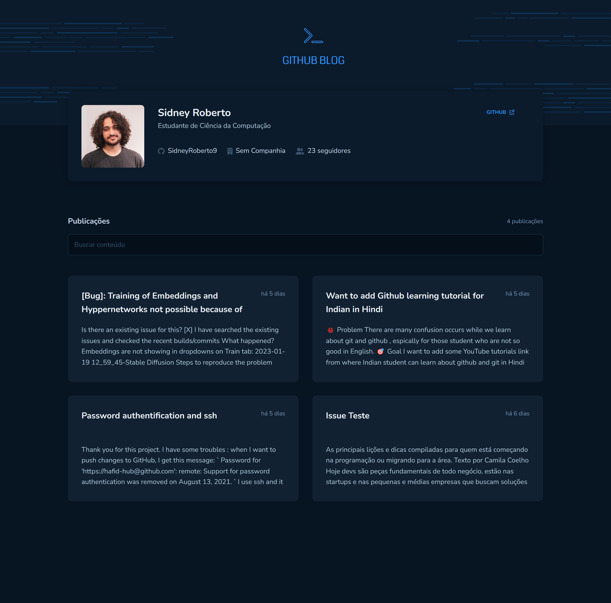

# Github Blog

<!---Esses são exemplos. Veja https://shields.io para outras pessoas ou para personalizar este conjunto de escudos. Você pode querer incluir dependências, status do projeto e informações de licença aqui--->


<a href="https://github-blog-sid.netlify.app/" target="_blank">Demo</a>


<br /> 
 
## 💻 Sobre

Este projeto é um blog sobre as issues do GitHub em um repositório específico. Ele foi construído como parte de um curso Ignite, usando as tecnologias React e Vite. O objetivo desse projeto era praticar requisições HTTP usando Axios. O blog mostra as issues mais recentes do repositório específico, incluindo títulos, descrições e informações de autoria, e permite que os usuários filtrem as issues por etiquetas e estado. O projeto foi desenvolvido com o objetivo de ajudar os usuários a acompanhar as issues do repositório e a praticar requisições HTTP com Axios.

<br />

## 🖱 Pré-requisitos

Antes de começar, verifique se você atendeu aos seguintes requisitos:

- Você instalou a versão mais recente de `node / npm / yarn`
  <br />

## ☕ Usando o Github Blog

Para usar o Github Blog, siga estas etapas:

```
git clone https://github.com/SidneyRoberto9/GithubBlog-Ignite

yarn ou npm i

yarn start ou npm start
```
